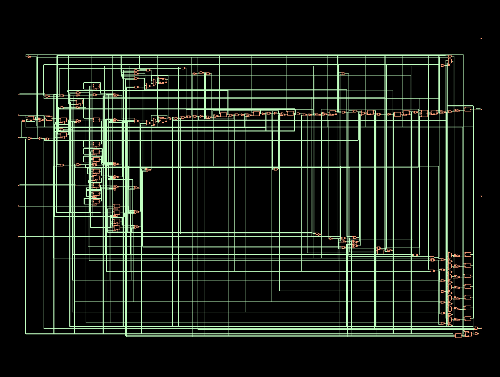
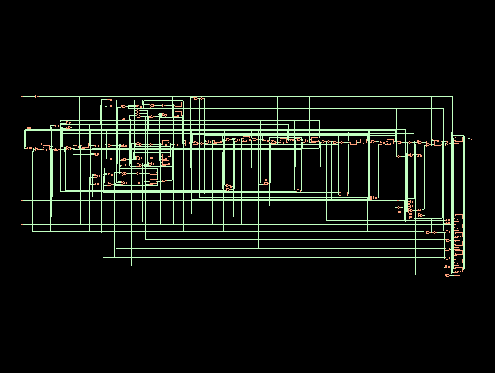

<h1>I2C Master-Slave Implementation and Verification</h1>

This repository contains the second-semester project for the CI-Digital course, focusing on the implementation and verification of I2C master and slave controllers using multiple verification methods.

<h2>Project Structure</h2>

<pre>
i2c_implementation_hdl/
├── RTL/ # RTL implementations
│ ├── V1.0/
│ ├── V2.0/
│ ├── V3.0/
│ ├── V4.0/
│ └── V5.0/ # Latest version with revision notes
├── Geral Testbenches/ # Basic testbenches
│ ├── V1.0/
│ ├── V2.0/
│ ├── V3.0/
│ ├── V4.0/
│ └── V5.0/ # Each contains prompt_icarus.txt with simulation commands
├── Assertions Testbench/ # Assertion-based verification
│ ├── V1.0/ # Uses RTL V3.0
│ ├── V2.0/ # Uses RTL V3.0, includes run_information.txt
│ ├── V3.0/ # Uses RTL V4.0, includes run_information.txt
│ └── V4.0/ # Uses RTL V5.0, includes run_information.txt
├── UVM Environments/ # UVM verification environments
│ ├── master/ # UVM environment for I2C master
│ └── slave/ # UVM environment for I2C slave
├── Synthesis/ # Synthesis files and scripts
└── README.md
</pre>

<h2>Register Transfer Level (RTL)</h2>

The versions can be accessed in the path <code>i2c_implementation_hdl/RTL</code>. The last version developed is V5.0, but all versions contain the following modules:

<ul>
<li><b>I2C Master Controller</b>: Implements I2C protocol master functionality</li>
<li><b>I2C Slave Controller</b>: Implements I2C protocol slave functionality</li>
</ul>

<h2>General Testbenches</h2>

The <b>General Testbenches</b> directory contains simple directed verification environments used for the initial functional validation of the RTL implementations. These testbenches focus on basic protocol behavior, verifying that the master and slave controllers correctly perform operations such as start condition generation, address transmission, read/write transactions, and data transfer on the I2C bus.

All testbenches in this repository are implemented in <b>SystemVerilog</b>. The environments instantiate the I2C master together with one or more slave controllers connected through shared "SDA" and "SCL" signals, modeling the open-drain behavior of the I2C bus.

Each testbench version corresponds to a specific RTL version and evolves together with the design. Earlier versions contain simpler directed tests aimed at validating core communication, while later versions include more complete scenarios, such as interactions with multiple slaves and improved verification of protocol behavior.

The simulations can be executed using <b>Icarus Verilog</b>. For convenience, every version directory includes a file named <code>prompt_icarus.txt</code>, which contains the commands required to compile and run the simulation. These commands compile the SystemVerilog testbench and RTL files using <code>iverilog</code> and execute the simulation with <code>vvp</code>, generating waveform files that can be analyzed with tools such as GTKWave.

<h2>Assertion-Based Verification</h2>

The assertion-based verification environments were developed according to the verification plan, aiming to formally check compliance with key aspects of the I2C protocol. These assertions monitor relevant bus events and protocol rules during simulation, enabling automatic detection of violations such as incorrect start/stop conditions, invalid address phases, or unexpected signal transitions.

The versions V3.0 and V4.0 (Final Version) include dedicated testbenches containing SystemVerilog Assertions (SVA) together with functional coverage definitions. During simulation, the coverage model generates coverage database files that can be analyzed using <b>Cadence IMC (Integrated Metrics Center)</b>, allowing inspection of the functional coverage results defined in the verification plan. The tests can be executed either in <b>EDA Playground</b> for quick experimentation or locally using <b>Cadence Xcelium</b>, which enables assertion checking and coverage database generation for further analysis in <b>IMC</b>.

<h2>UVM Environments</h2>

The UVM (Universal Verification Methodology) based verification was implemented for the I2C controllers, resulting in complete and reusable environments following the recommended methodology practices. The UVM environments are organized in the <code>UVM Environments</code> folder, which is divided into two main sections: <code>master</code> and <code>slave</code>, each containing numbered versions from V1.0 to V4.0. Version V2.0 is already complete and was developed to validate RTL version V4.0, while version V3.0 is dedicated to RTL version V5.0 (final version) and version V3.1 is used for the verification of the netlist obtained after synthesis. Each version includes a complete structure with sequences, drivers, monitors, agents, scoreboards, and multiple test classes, allowing everything from basic transactions to stress scenarios and error injection. For easy access and execution, each version contains a <code>run_information.txt</code> file with a direct link to EDA Playground, where the UVM environment is already pre-configured and ready for simulation, allowing result analysis and exploration of the different implemented tests.

<h2>Netlist Generation and Gate-Level Simulation (GLS)</h2>

The netlist generation, as well as the Gate-Level Simulation (GLS), can be accessed in the <code>Synthesis/</code> directory of the project repository. Using the <b>Cadence Genus</b> interface, the following netlists were generated. It is important to highlight that the netlists were generated based on <b>RTL version 5.0</b>, which represents the current stable and synthesizable version of the design.

  

<b>Figure 1</b> – Netlist obtained for the <code>i2c_master_controller</code> module (161 standard cells).

  

<b>Figure 2</b> – Netlist obtained for the <code>i2c_slave_controller</code> module (124 standard cells).

The Gate-Level Simulation can be accessed in the corresponding <code>GLS/</code> directory. By developing a simple Verilog testbench and validating the generated netlists, the communication behavior between the master and slave modules was verified as expected, confirming that the RTL described in version 5.0 is functionally synthesizable.

For verification purposes, users are encouraged to refer to the <b>UVM-based environments available in version 3.1</b>, which include structured testbenches for both the master and slave controllers.

<h2>Synthesis and Reports</h2>

The synthesis process was carried out using <b>Cadence Genus</b>, with the synthesis scripts available in the directory <code>i2c_implementation_hdl/Synthesis/Creating_Netlists/script/</code>. The files <code>setup_master_i2c.tcl</code> and <code>setup_slave_i2c.tcl</code> contain the complete synthesis setup for the master and slave controllers, respectively, and can be executed in Genus using the <code>source</code> command. The constraints used during synthesis, including clock definition and input/output delays, are provided in the constraints file accessible at <code>i2c_implementation_hdl/Synthesis/Creating_Netlists/constraints/</code>. The target technology was the <b>Nangate 45nm cell library</b>.

The resulting synthesis reports are organized in the subfolders <code>report_master</code> and <code>report_slaves</code>, also located under the <code>script/</code> directory. Each folder contains the generated reports for area (<code>report_area.rpt</code>), power (<code>report_power.rpt</code>), timing (<code>report_timing.rpt</code>), and overall quality of results (<code>report_qor.rpt</code>). These reports provide a detailed analysis of the synthesized design's Power, Performance, and Area (PPA), allowing evaluation of the implementation feasibility and guiding potential RTL optimizations before proceeding to physical design.

The synthesis flow depends on proprietary technology files and standard cell libraries that are not included in this repository. In order to successfully execute the provided TCL scripts, the user must have access to the required Cadence-compatible libraries, including the <code>fast_vdd1v0_basicCells</code> and <code>slow_vdd1v0_basicCells</code> standard cell libraries (both <code>.lib</code> and corresponding Verilog <code>.v</code> files), as well as the technology LEF files <code>gsclib045_macro.lef</code> and <code>gsclib045_tech.lef</code>. These files must be obtained separately (e.g., from an academic or licensed distribution such as the Nangate 45nm library) and manually placed in the appropriate directories under <code>Synthesis/Creating_Netlists/</code>. Due to licensing restrictions, these resources cannot be redistributed as part of this repository.

